<div align="center">



<h1>Omit Hasan Ador</h1>



<br/>

[](https://nextjs.org)
[](https://react.dev)
[](https://tailwindcss.com)
[](https://www.framer.com/motion/)
[](https://vercel.com/new)


</div>

<br/>

Personal portfolio for **Omit Hasan Ador** — a Frontend-focused MERN Stack
Developer from Bangladesh. Built with Next.js (App Router) and Tailwind CSS,
styled as a quiet, editorial dark theme instead of the generic
neon-glow "AI portfolio" template look.

<br/>

<div align="center">

</div>

## Contents

- [Tech stack](#tech-stack)
- [Features](#features)
- [Getting started](#getting-started)
- [Hero video](#hero-video)
- [Fonts](#fonts)
- [Project structure](#project-structure)
- [Deploying to Vercel](#deploying-to-vercel)
- [Content](#content)
- [Contact](#contact)

<br/>

## Tech stack

<table>
<tr>
<td valign="top" width="33%">

**Frontend**
- React 19
- Next.js 16 (App Router)
- Tailwind CSS v4
- Framer Motion

</td>
<td valign="top" width="33%">

**In progress / backend**
- Node.js
- Express.js
- MongoDB + Mongoose
- Better Auth

</td>
<td valign="top" width="33%">

**Tooling**
- Git & GitHub
- Vercel
- Figma
- ESLint

</td>
</tr>
</table>

<div align="center">

</div>

## Features

- 🎬 Full-bleed video hero with a graceful gradient fallback
- 🎞️ Editorial filmstrip carousel for Projects, with a live re-graded backdrop
- 🧱 Bento-grid Services section with staggered scroll reveals
- 📊 Animated proficiency bars in Skills & Technologies
- 🌗 Light (eggshell) / dark (navy) theme, toggled from the navbar
- 📱 Mobile-first: a fixed glass pill tab bar on mobile, top nav on desktop
- ⏳ A percentage-counter loading screen on first visit
- 🪟 "Liquid glass" buttons and cards throughout
- 🗂️ Project modal with tech stack + feature breakdown
- ❓ Accordion FAQ section
- 📬 Working contact form wired to a live API endpoint
- ⚡ Zero-config Vercel deploy

<div align="center">

</div>

## Theming

Light and dark themes are handled by `next-themes` (`src/components/theme-provider.jsx`),
toggled with the sun/moon switch in the navbar (`src/components/ThemeToggle.jsx`).
Both palettes live as CSS custom properties in `src/app/globals.css`:

- `:root` — light theme, eggshell background
- `.dark` — dark theme, deep navy background (the default)

Add or adjust colors by editing those two blocks; every component reads
from the same `--background`, `--card`, `--foreground`, etc. tokens, so
nothing needs to change component-side.

<div align="center">

</div>

## Getting started

```bash
npm install
npm run dev
```

Open http://localhost:3000.

<div align="center">

</div>

## Hero video

The hero section plays a looping background video. It currently falls back
to the original CDN-hosted source, so it works out of the box:

```
https://d8j0ntlcm91z4.cloudfront.net/user_38xzZboKViGWJOttwIXH07lWA1P/hf_20260314_131748_f2ca2a28-fed7-44c8-b9a9-bd9acdd5ec31.mp4
```

For a permanent setup that doesn't depend on a third-party account, download
that file once and drop it into `public/videos/` with these exact names —
the `<video>` element checks for them first, before falling back to the CDN
link:

- `hero.mp4` (required for the self-hosted path)
- `hero.webm` (optional, smaller file size)
- `hero-poster.jpg` (optional, shown while the video loads)

No code changes needed either way.

## Fonts

Instrument Serif and Inter are loaded via `next/font/google` in
`src/app/layout.js` (the same two families/weights as the original
`fonts.googleapis.com/css2?family=Instrument+Serif:ital@0;1` and
`family=Inter:wght@400;500;600` imports) — Next.js self-hosts the font files
at build time instead of fetching from Google at runtime, which is faster
and avoids an external request on every page load.

<div align="center">

</div>

## Project structure

```
src/
├─ app/
│  ├─ layout.js        # fonts, theme provider, preloader, metadata
│  ├─ page.js           # section order
│  ├─ globals.css       # light/dark tokens, glass utility, animations
│  ├─ icon.svg           # animated favicon (modern browsers)
│  └─ favicon.ico        # static favicon (universal fallback)
├─ components/
│  ├─ Navbar.jsx         # top bar (desktop) + fixed tab bar (mobile)
│  ├─ Hero.jsx, About.jsx, Skills.jsx, Services.jsx
│  ├─ Projects.jsx, ProjectModal.jsx, FAQ.jsx, Contact.jsx, Footer.jsx
│  ├─ Preloader.jsx      # first-visit loading screen
│  ├─ ThemeToggle.jsx    # light/dark switch
│  ├─ theme-provider.jsx # next-themes wrapper
│  ├─ LogoMark.jsx       # animated "OA" monogram
│  └─ ui/
│     ├─ button.jsx           # shared button incl. the glass variant
│     ├─ menu-toggle.jsx      # animated hamburger ↔ close icon
│     ├─ bottom-nav-bar.jsx   # mobile fixed tab bar
│     ├─ hero-carousel.jsx    # Projects filmstrip carousel
│     └─ timeline-animation.jsx # scroll-triggered stagger reveal
└─ data/
   ├─ projects.js, faqs.js, contact.js
```

All personal data (projects, FAQs, contact info) lives in `src/data/*.js`,
so it can be updated without touching component code.

<div align="center">

</div>

## Deploying to Vercel

This is a standard Next.js app, so it deploys to Vercel with zero
configuration:

1. Push this repo to GitHub.
2. Import it at [vercel.com/new](https://vercel.com/new).
3. Vercel detects Next.js automatically — no build settings to change.

## Content

<table>
<tr><td>Projects</td><td>WanderLast, SunCart, MediQueue</td></tr>
<tr><td>Skills</td><td>Frontend, Backend, Tools & Workflow</td></tr>
<tr><td>Services</td><td>Landing pages, business & e-commerce sites, portfolios, Next.js apps</td></tr>
</table>

<div align="center">

</div>

## Contact

<div align="center">

[](mailto:ibneshams05@gmail.com)
[](https://github.com/OmitHasanAdor)
[](https://www.linkedin.com/in/web-omit-hasan-link)

<sub>© 2026 Omit Hasan Ador — built with Next.js, Tailwind CSS & Framer Motion</sub>

</div>
